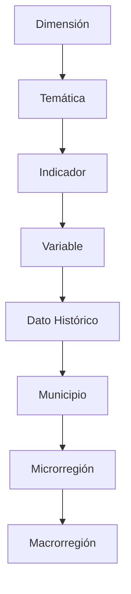
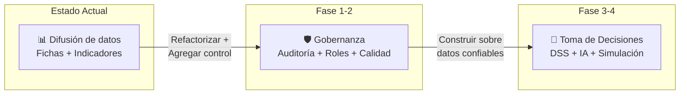

# Análisis FODA y Hoja de Ruta: Transformación hacia Gobernanza de Datos y Toma de Decisiones

## Radiografía del Estado Actual

El sistema **Fichas Municipales** es una plataforma Laravel 8 que gestiona indicadores estadísticos municipales con una jerarquía de datos bien definida:

**Capacidades actuales:**
- Banco de indicadores con búsqueda y filtrado
- Fichas municipales con perfiles, comparativas y rankings
- Importación masiva desde Excel (dimensiones, temáticas, indicadores, variables, datos)
- API pública (OpenAPI) para consulta de datos
- Exportación a PDF/Excel
- Dashboard administrativo con "Salud de Datos" básica
- Servicio narrativo inteligente ([FichaNarratorService](file:///c:/laragon/www/fichas_municipales/app/Services/FichaNarratorService.php)) que genera textos interpretativos con tendencias, comparativas y rankings
- Servicio de perfilado ([FichaProfilerService](file:///c:/laragon/www/fichas_municipales/app/Services/FichaProfilerService.php)) con KPIs clave (pobreza, marginación, presupuesto, PEA)

---

## 📊 Análisis FODA

### ✅ Fortalezas

| # | Fortaleza | Evidencia en el código |
|---|-----------|----------------------|
| F1 | **Modelo de datos jerárquico maduro** | La cadena `Dimensión → Temática → Indicador → Variable → DatoHistórico` con 48 migraciones evolutivas demuestra un diseño iterado y probado |
| F2 | **Motor narrativo inteligente** | [FichaNarratorService](file:///c:/laragon/www/fichas_municipales/app/Services/FichaNarratorService.php) ya interpreta datos con polaridad, tendencias, percentiles y comparativas — la semilla de un sistema de toma de decisiones |
| F3 | **Validación de calidad de datos** | [DashboardController::dataHealth()](file:///c:/laragon/www/fichas_municipales/app/Http/Controllers/Admin/DashboardController.php#L47-L114) detecta indicadores vacíos, variables huérfanas, datos desactualizados y atípicos |
| F4 | **Pipeline de importación robusto** | [ImportController](file:///c:/laragon/www/fichas_municipales/app/Http/Controllers/Admin/ImportController.php) (26KB) con validación en dos fases (validar → ejecutar) para datos históricos |
| F5 | **API pública documentada** | Endpoints REST con especificación OpenAPI y documentación interactiva en `/api/docs` |
| F6 | **Cobertura geográfica completa** | Modelado de 3 niveles territoriales (Municipio, Microrregión, Macrorregión) con perfiles y comparativas regionales |
| F7 | **Exportación multi-formato** | Descarga de datos en Excel, CSV y PDF; sección de datos abiertos funcional |
| F8 | **Controlador central potente** | [FichaController](file:///c:/laragon/www/fichas_municipales/app/Http/Controllers/FichaController.php) (139KB) concentra lógica analítica avanzada: rankings, similitud, gráficos dinámicos |

---

### ⚠️ Oportunidades

| # | Oportunidad | Impacto en Gobernanza / Decisiones |
|---|-------------|-----------------------------------|
| O1 | **Capa de Gobernanza de Datos formal** | No existe un módulo que rastree linaje, responsables, diccionario de datos ni políticas de actualización. Agregarlo convertiría el sistema en una plataforma de gobernanza real |
| O2 | **Alertas y notificaciones proactivas** | La "Salud de Datos" es reactiva (solo se ve visitando el dashboard). Un sistema de alertas automáticas detectaría problemas antes de que impacten decisiones |
| O3 | **Tableros de toma de decisiones (DSS)** | El `FichaNarratorService` genera textos, pero no existe un dashboard ejecutivo con semáforos, metas vs. resultados, ni escenarios simulados |
| O4 | **Auditoría y trazabilidad** | No hay logs de quién importó qué dato, cuándo se modificó un indicador, ni versionado de cambios. Esto es fundamental para gobernanza |
| O5 | **Roles y permisos granulares** | El modelo `User` es básico (name, email, password). No hay roles (admin, analista, consultor, capturista) ni permisos por dimensión/municipio |
| O6 | **Integración con IA generativa** | El `FichaNarratorService` usa plantillas estáticas. Un LLM podría generar análisis narrativos contextualizados, identificar correlaciones y sugerir acciones |
| O7 | **Workflows de aprobación de datos** | No existe un flujo de revisión antes de publicar datos. Los datos importados se publican inmediatamente sin validación institucional |
| O8 | **Indicadores calculados / derivados** | El campo `metodo_calculo` existe pero no se ejecuta automáticamente. Automatizar cálculos (tasas, índices compuestos) evitaría errores humanos |

---

### 🔴 Debilidades

| # | Debilidad | Detalle técnico |
|---|-----------|----------------|
| D1 | **Controlador monolítico** | [FichaController.php](file:///c:/laragon/www/fichas_municipales/app/Http/Controllers/FichaController.php) tiene **139KB** (~3,500 líneas). Mezcla lógica de negocio, queries y presentación. Cualquier cambio es riesgoso |
| D2 | **Sin auditoría de cambios** | No hay tabla `audit_logs` ni paquete como `spatie/laravel-activitylog`. Imposible saber quién alteró un dato |
| D3 | **Framework desactualizado** | Laravel 8 alcanzó End of Life en enero 2023. Sin parches de seguridad ni acceso a features modernos (Enums, mejoras de Eloquent, etc.) |
| D4 | **Sin roles ni permisos** | Todos los usuarios admin tienen acceso completo. No hay segregación de responsabilidades ni protección por área |
| D5 | **Sin tests automatizados reales** | `.phpunit.result.cache` existe pero la carpeta `tests/` está vacía o mínima. Cambios grandes son arriesgados sin red de seguridad |
| D6 | **Lógica de negocio en consultas raw** | La detección de datos atípicos en [DashboardController](file:///c:/laragon/www/fichas_municipales/app/Http/Controllers/Admin/DashboardController.php#L79-L104) usa SQL crudo. Difícil de mantener y propenso a errores |
| D7 | **Capa de servicios incipiente** | Solo 3 servicios en `app/Services/`. La mayor parte de la lógica vive en controladores, dificultando reutilización y testing |
| D8 | **Sin diccionario de datos formal** | Los indicadores tienen `descripcion` y `fuente`, pero no hay metadatos completos (periodicidad, responsable, fecha de vigencia, metodología) |

---

### 🚨 Amenazas

| # | Amenaza | Riesgo |
|---|---------|--------|
| A1 | **Deuda técnica acumulada** | El controlador de 139KB y la falta de tests hacen que cada nueva funcionalidad de gobernanza sea exponencialmente más costosa y riesgosa |
| A2 | **Seguridad del framework** | Laravel 8 sin soporte = vulnerabilidades conocidas sin parche. Un sistema de gobernanza maneja datos sensibles |
| A3 | **Dependencia de un solo desarrollador** | La complejidad del controlador monolítico y la falta de documentación técnica crean bus factor = 1 |
| A4 | **Datos sin control de calidad institucional** | Sin workflows de aprobación, datos erróneos pueden fundamentar decisiones de política pública incorrectas |
| A5 | **Escalabilidad limitada** | Sin caché estratégico, sin jobs en cola, sin paginación en varias consultas. Más municipios/años = degradación de performance |

---

## 🗺️ Hoja de Ruta Propuesta: Transformación en 4 Fases

### Fase 1: Cimientos de Gobernanza (4-6 semanas)

> [!IMPORTANT]
> Esta fase es prerequisito para todo lo demás. Sin ella, construir funcionalidades de gobernanza sobre la base actual es construir sobre arena.

| Componente | Descripción |
|------------|-------------|
| **Auditoría de datos** | Implementar `spatie/laravel-activitylog` para registrar toda modificación a indicadores, variables y datos históricos |
| **Roles y permisos** | Implementar `spatie/laravel-permission` con roles: `super_admin`, `gobernanza`, `analista`, `capturista`, `consultor_público` |
| **Diccionario de datos** | Extender modelos con campos de metadata: `responsable`, `periodicidad`, `fecha_vigencia`, `metodologia_url`, `clasificacion_confidencialidad` |
| **Refactorización del controlador** | Extraer `FichaController` en servicios especializados: `IndicadorAnalyticsService`, `RankingService`, `MapDataService`, `ExportService` |

---

### Fase 2: Calidad y Workflows (3-4 semanas)

| Componente | Descripción |
|------------|-------------|
| **Workflow de publicación** | Estados para datos importados: `borrador → en_revisión → aprobado → publicado`. Solo datos "publicados" son visibles en el área pública |
| **Alertas automáticas** | Jobs programados que ejecuten las validaciones de "Salud de Datos" y notifiquen por email/sistema cuando detecten anomalías |
| **Reglas de calidad configurables** | Panel donde un administrador defina umbrales de detección atípica, periodicidad esperada por indicador, y reglas de completitud |
| **Linaje de datos** | Registro del origen de cada dato (importación manual, cálculo automático, fuente externa) con fecha y usuario |

---

### Fase 3: Sistema de Soporte a Decisiones — DSS (4-6 semanas)

| Componente | Descripción |
|------------|-------------|
| **Dashboard ejecutivo** | Vista con semáforos por dimensión, avance de metas, comparativas temporales y ranking en un solo vistazo |
| **Tablero de alertas tempranas** | Identificación automática de municipios con indicadores en deterioro vs. periodo anterior |
| **Indicadores calculados** | Motor que ejecute `metodo_calculo` automáticamente al importar datos base (ej. tasa de crecimiento = `(valor_actual - valor_anterior) / valor_anterior * 100`) |
| **Narrativas inteligentes con IA** | Evolucionar `FichaNarratorService` para usar un LLM que genere análisis contextualizados, identifique correlaciones entre dimensiones y sugiera líneas de acción |
| **Simulador de escenarios** | "¿Qué pasa si el FAISMUN crece 10%?" — proyecciones basadas en tendencias históricas |

---

### Fase 4: Maduración y Escala (3-4 semanas)

| Componente | Descripción |
|------------|-------------|
| **Actualización a Laravel 11+** | Migración del framework para seguridad, performance y acceso a features modernos |
| **API de gobernanza** | Endpoints para consultar linaje, auditoría y estado de calidad de datos programáticamente |
| **Portal de datos para ciudadanos** | Evolución de "datos abiertos" con visualizaciones interactivas, storytelling y accesibilidad |
| **Suite de tests** | Cobertura de tests unitarios para servicios críticos y tests de integración para importación |

---

## Open Questions

> [!IMPORTANT]
> **¿Cuál es el contexto institucional?** ¿Este sistema es operado por un gobierno estatal, un organismo de planeación, o un instituto de información? Esto impacta qué estándares de gobernanza aplicar (ej. Ley de Transparencia, SNIEG, normativa INEGI).

> [!IMPORTANT]
> **¿Qué tan urgente es la actualización de Laravel?** ¿El sistema está expuesto a internet en producción? Si es así, la seguridad del framework es una prioridad crítica que debería moverse a Fase 1.

> [!WARNING]
> **¿Existe voluntad de cambiar procesos de trabajo?** Un sistema de gobernanza implica que los datos ya no se publican inmediatamente — requiere workflows de aprobación. ¿Los usuarios actuales están preparados para este cambio?

> [!NOTE]
> **¿Hay presupuesto para servicios de IA?** La Fase 3 propone uso de LLMs. ¿Se tiene acceso a APIs como Gemini, OpenAI o una solución on-premise?

---

## Resumen Ejecutivo

El proyecto tiene **una base sólida y valiosa** — especialmente el modelo de datos jerárquico, el servicio narrativo y la detección de calidad. La transformación no requiere reconstruir, sino **evolucionar**: primero controlar (gobernanza), luego decidir (DSS).

**El mayor riesgo inmediato** es el controlador monolítico de 139KB y la falta de auditoría. Atacar esto primero desbloqueará todo lo demás.
