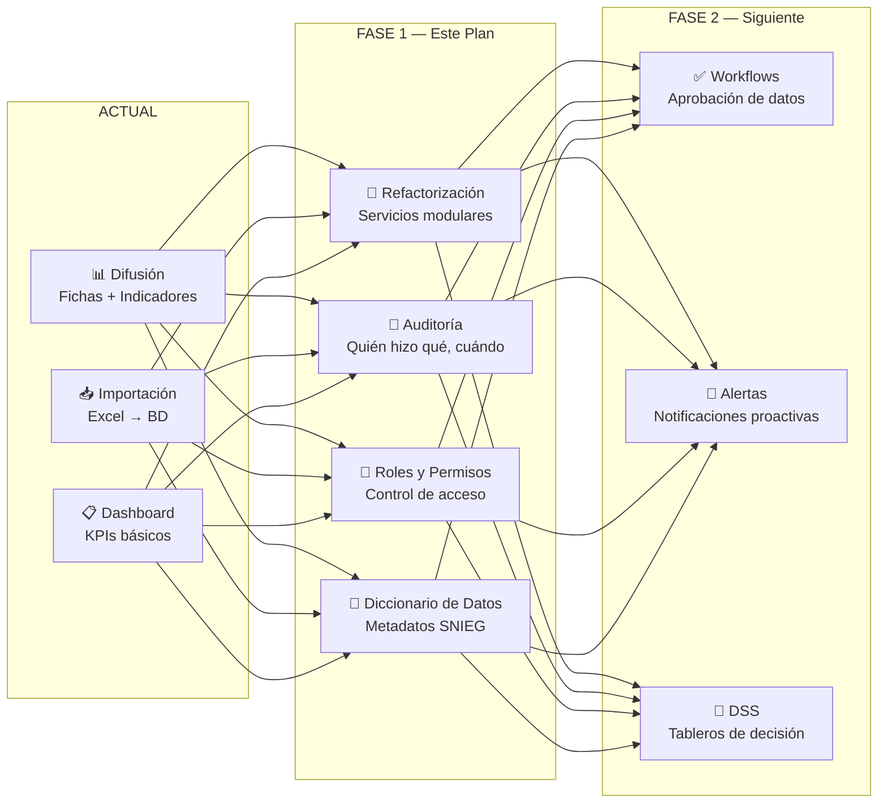
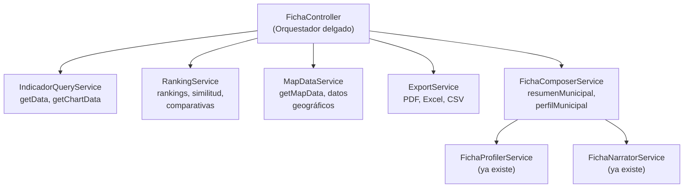

# Plan de Implementación — Fase 1: Cimientos de Gobernanza de Datos

**Contexto institucional:** Sistema Estatal de Información (SEI) del Gobierno de Puebla  
**Stack:** Laravel 12, PHP 8.2+, MySQL, Tailwind CSS, Alpine.js  
**Objetivo:** Sentar las bases técnicas para convertir la plataforma de difusión de indicadores en un sistema de gobernanza de datos y soporte a la toma de decisiones.

---

## Visión General de la Transformación



---

## A. Refactorización del Controlador Monolítico

> [!WARNING]
> [FichaController.php](file:///c:/laragon/www/fichas_municipales/app/Http/Controllers/FichaController.php) tiene **2,896 líneas / 139KB** con 19 métodos públicos que mezclan queries, lógica de negocio, preparación de gráficos y exportación. Esto bloquea cualquier mejora: tests, auditoría y extensión con gobernanza son imposibles mientras la lógica viva aquí.

### Estrategia: Extraer en 5 Servicios

No se eliminará funcionalidad — se moverá lógica a servicios inyectables y el controlador quedará como orquestador delgado.



### Archivos a crear

| Archivo | Responsabilidad | Métodos que absorbe del FichaController |
|---------|----------------|----------------------------------------|
| [NEW] `app/Services/IndicadorQueryService.php` | Consultas de datos estadísticos | `getData()`, `getChartData()`, `getIndicatorYears()`, `getAniosPorDimension()`, `getAniosPorIndicadorComplejo()` |
| [NEW] `app/Services/RankingService.php` | Rankings y comparativas | `getSimilitudIndicador()`, lógica de rankings dentro de `resumenMunicipalV3()` |
| [NEW] `app/Services/MapDataService.php` | Preparación de datos geográficos | `getMapData()` |
| [NEW] `app/Services/ExportService.php` | Exportación multi-formato | `exportData()`, `exportarResumenPDF()`, `exportDatosComplejos()`, `exportarComparativaPDF()` |
| [NEW] `app/Services/FichaComposerService.php` | Composición de fichas y perfiles | Lógica pesada dentro de `resumenMunicipalV3()`, `perfilMunicipal()`, `compararMunicipal()` |

#### [MODIFY] [FichaController.php](file:///c:/laragon/www/fichas_municipales/app/Http/Controllers/FichaController.php)

Quedará como orquestador. Ejemplo del patrón:

```php
// ANTES (lógica directa en controlador):
public function getData(Request $request) {
    // 200+ líneas de queries, joins, formateo...
}

// DESPUÉS (delega al servicio):
public function getData(Request $request) {
    $validated = $request->validate([...]);
    $data = $this->indicadorQuery->getChartData($validated);
    return response()->json($data);
}
```

> [!TIP]
> Esta refactorización se puede hacer **incrementalmente** — un servicio a la vez, sin romper funcionalidad existente. Empezaríamos por `ExportService` (el más independiente) y terminaríamos con `FichaComposerService` (el más complejo).

---

## B. Sistema de Auditoría

### Objetivo
Registrar toda modificación a datos del sistema: quién importó datos, quién editó un indicador, quién borró una variable. Fundamental para gobernanza y cumplimiento con la Ley de Transparencia.

### Paquete: `spatie/laravel-activitylog`

#### [NEW] Migración: `create_activity_log_table`

Se crea automáticamente al publicar las migraciones del paquete.

#### [MODIFY] Modelos — Agregar trait `LogsActivity`

```php
// Modelos a modificar:
// - DatoHistorico.php
// - Indicador.php
// - Variable.php
// - Dimension.php
// - Tematica.php
// - Municipio.php
// - ConfiguracionFicha.php

use Spatie\Activitylog\Traits\LogsActivity;
use Spatie\Activitylog\LogOptions;

class Indicador extends Model
{
    use HasFactory, LogsActivity;

    public function getActivitylogOptions(): LogOptions
    {
        return LogOptions::defaults()
            ->logAll()                          // Registra cambios en todos los campos
            ->logOnlyDirty()                    // Solo campos que realmente cambiaron
            ->setDescriptionForEvent(fn(string $eventName) => 
                "El indicador '{$this->nombre_amigable}' fue {$eventName}"
            );
    }
}
```

#### [NEW] `app/Http/Controllers/Admin/AuditoriaController.php`

```php
class AuditoriaController extends Controller
{
    public function index(Request $request)
    {
        $logs = Activity::with('causer', 'subject')
            ->when($request->modelo, fn($q, $m) => $q->where('subject_type', $m))
            ->when($request->usuario, fn($q, $u) => $q->where('causer_id', $u))
            ->when($request->desde, fn($q, $d) => $q->where('created_at', '>=', $d))
            ->latest()
            ->paginate(50);

        return view('admin.auditoria.index', compact('logs'));
    }
}
```

#### [NEW] `resources/views/admin/auditoria/index.blade.php`

Vista con tabla filtrable que muestra:
- **Fecha/hora** del evento
- **Usuario** que realizó la acción
- **Modelo afectado** (Indicador, Variable, etc.)
- **Tipo de evento** (created, updated, deleted)
- **Detalle de cambios** (campos antes → después)

#### [MODIFY] [admin-navigation.blade.php](file:///c:/laragon/www/fichas_municipales/resources/views/layouts/admin-navigation.blade.php)

Agregar enlace "Auditoría" en la barra de navegación admin (entre "Salud" y "Importación").

#### [MODIFY] [web.php](file:///c:/laragon/www/fichas_municipales/routes/web.php)

```php
// Dentro del grupo admin
Route::get('/auditoria', [AuditoriaController::class, 'index'])->name('auditoria.index');
```

---

## C. Roles y Permisos Institucionales

### Objetivo
Implementar control de acceso basado en roles alineado con la estructura organizacional del SEI Puebla.

### Paquete: `spatie/laravel-permission`

### Roles propuestos

| Rol | Descripción | Permisos clave |
|-----|-------------|----------------|
| `super_admin` | Administrador del sistema | Todo — gestión técnica completa |
| `gobernanza` | Responsable de calidad de datos (Director/a del SEI) | Ver auditoría, aprobar datos, gestionar diccionario de datos, ver dashboard ejecutivo |
| `analista` | Generador de fichas y reportes | Consultar todos los datos, exportar, comparar municipios, ver dashboard |
| `capturista` | Importador de datos | Importar datos, gestionar catálogos, NO puede eliminar |
| `consultor` | Acceso solo lectura al admin | Ver dashboard, ver catálogos, ver auditoría — NO puede modificar nada |

### Archivos a crear/modificar

#### [NEW] Migración y Seeder del paquete

Se publican automáticamente. Luego:

#### [NEW] `database/seeders/RolesAndPermissionsSeeder.php`

```php
class RolesAndPermissionsSeeder extends Seeder
{
    public function run()
    {
        // Resetear cache de permisos
        app()[\Spatie\Permission\PermissionRegistrar::class]->forgetCachedPermissions();

        // Permisos por módulo
        $permisos = [
            // Catálogos
            'catalogos.ver', 'catalogos.crear', 'catalogos.editar', 'catalogos.eliminar',
            // Datos
            'datos.ver', 'datos.crear', 'datos.editar', 'datos.eliminar', 'datos.importar',
            // Usuarios
            'usuarios.ver', 'usuarios.crear', 'usuarios.editar', 'usuarios.eliminar',
            // Auditoría
            'auditoria.ver',
            // Dashboard ejecutivo (Fase 2)
            'dashboard.ejecutivo',
            // Gobernanza
            'diccionario.ver', 'diccionario.editar',
            'datos.aprobar',    // Para workflow futuro
        ];

        foreach ($permisos as $permiso) {
            Permission::create(['name' => $permiso]);
        }

        // Roles
        Role::create(['name' => 'super_admin'])->givePermissionTo(Permission::all());
        
        Role::create(['name' => 'gobernanza'])->givePermissionTo([
            'catalogos.ver', 'datos.ver', 'datos.aprobar',
            'auditoria.ver', 'diccionario.ver', 'diccionario.editar',
            'dashboard.ejecutivo',
        ]);
        
        Role::create(['name' => 'analista'])->givePermissionTo([
            'catalogos.ver', 'datos.ver', 'auditoria.ver',
        ]);
        
        Role::create(['name' => 'capturista'])->givePermissionTo([
            'catalogos.ver', 'catalogos.crear', 'catalogos.editar',
            'datos.ver', 'datos.crear', 'datos.editar', 'datos.importar',
        ]);
        
        Role::create(['name' => 'consultor'])->givePermissionTo([
            'catalogos.ver', 'datos.ver', 'auditoria.ver',
        ]);
    }
}
```

#### [MODIFY] [User.php](file:///c:/laragon/www/fichas_municipales/app/Models/User.php)

```php
use Spatie\Permission\Traits\HasRoles;

class User extends Authenticatable
{
    use HasApiTokens, HasFactory, Notifiable, HasRoles;
    // ...
}
```

#### [MODIFY] Controladores Admin — Agregar middleware de permisos

```php
// Ejemplo en ImportController
public function __construct()
{
    $this->middleware('permission:datos.importar');
}

// Ejemplo en CatalogoController
public function __construct()
{
    $this->middleware('permission:catalogos.ver')->only(['index']);
    $this->middleware('permission:catalogos.crear')->only(['store*']);
    $this->middleware('permission:catalogos.editar')->only(['update*']);
    $this->middleware('permission:catalogos.eliminar')->only(['destroy*']);
}
```

#### [MODIFY] [admin-navigation.blade.php](file:///c:/laragon/www/fichas_municipales/resources/views/layouts/admin-navigation.blade.php)

Envolver cada enlace con directivas `@can`:

```blade
@can('datos.importar')
    <li class="nav-item">
        <a class="nav-link" href="{{ route('admin.import.index') }}">Importación</a>
    </li>
@endcan

@can('usuarios.ver')
    <li class="nav-item">
        <a class="nav-link" href="{{ route('admin.users.index') }}">Usuarios</a>
    </li>
@endcan
```

#### [MODIFY] Vista de gestión de usuarios

Agregar selector de rol al formulario de crear/editar usuario.

---

## D. Diccionario de Datos y Metadatos SNIEG

### Objetivo
Extender el catálogo de indicadores con campos de metadatos alineados a estándares SNIEG (Sistema Nacional de Información Estadística y Geográfica) para documentar formalmente cada indicador.

### Archivos

#### [NEW] Migración: `add_governance_metadata_to_indicadors_table`

```php
Schema::table('indicadors', function (Blueprint $table) {
    // Metadatos SNIEG / Gobernanza
    $table->string('responsable')->nullable();                    // Área responsable del indicador
    $table->string('periodicidad')->nullable();                   // anual, semestral, trimestral, etc.
    $table->date('fecha_vigencia_inicio')->nullable();            // Desde cuándo es válido
    $table->date('fecha_vigencia_fin')->nullable();               // Hasta cuándo (null = vigente)
    $table->text('metodologia')->nullable();                      // Descripción de cálculo
    $table->string('metodologia_url')->nullable();                // URL a documento metodológico
    $table->enum('clasificacion', [                               // Nivel de confidencialidad
        'publica', 'uso_interno', 'confidencial'
    ])->default('publica');
    $table->enum('estado_publicacion', [                          // Para workflow futuro
        'borrador', 'en_revision', 'publicado', 'deprecado'
    ])->default('publicado');
    $table->string('cobertura_geografica')->nullable();           // estatal, municipal, localidad
    $table->string('unidad_responsable')->nullable();             // Dependencia de gobierno
    $table->text('notas_metodologicas')->nullable();              // Observaciones técnicas
    $table->string('norma_tecnica')->nullable();                  // Referencia a norma SNIEG
});
```

#### [NEW] Migración: `add_metadata_to_variables_table`

```php
Schema::table('variables', function (Blueprint $table) {
    $table->string('tipo_valor')->nullable();       // entero, decimal, porcentaje, categórico
    $table->decimal('valor_minimo', 20, 4)->nullable();
    $table->decimal('valor_maximo', 20, 4)->nullable();
    $table->text('definicion_operativa')->nullable();
    $table->string('fuente_primaria')->nullable();
});
```

#### [MODIFY] [Indicador.php](file:///c:/laragon/www/fichas_municipales/app/Models/Indicador.php)

Agregar los nuevos campos a `$fillable`.

#### [MODIFY] [Variable.php](file:///c:/laragon/www/fichas_municipales/app/Models/Variable.php)

Agregar los nuevos campos a `$fillable`.

#### [NEW] `resources/views/admin/diccionario/index.blade.php`

Vista del "Diccionario de Datos" — tabla interactiva que muestra todos los indicadores con sus metadatos de gobernanza, estado de documentación (completo / incompleto), y acciones de edición.

#### [NEW] `app/Http/Controllers/Admin/DiccionarioController.php`

```php
class DiccionarioController extends Controller
{
    public function __construct()
    {
        $this->middleware('permission:diccionario.ver');
        $this->middleware('permission:diccionario.editar')->only(['edit', 'update']);
    }

    public function index()
    {
        $indicadores = Indicador::with('tematica.dimension', 'variables')
            ->get()
            ->map(fn($ind) => [
                'indicador' => $ind,
                'completitud' => $this->calcularCompletitud($ind),
            ]);
        
        return view('admin.diccionario.index', compact('indicadores'));
    }

    // Calcula % de llenado de metadatos
    private function calcularCompletitud(Indicador $ind): int
    {
        $campos = ['responsable', 'periodicidad', 'metodologia', 
                    'cobertura_geografica', 'unidad_responsable', 'norma_tecnica'];
        $llenos = collect($campos)->filter(fn($c) => !empty($ind->$c))->count();
        return intval(($llenos / count($campos)) * 100);
    }
}
```

---

## Resumen de Archivos a Crear/Modificar

### Archivos Nuevos (12)

| # | Archivo | Componente |
|---|---------|-----------|
| 1 | `app/Services/IndicadorQueryService.php` | A - Refactorización |
| 2 | `app/Services/RankingService.php` | A - Refactorización |
| 3 | `app/Services/MapDataService.php` | A - Refactorización |
| 4 | `app/Services/ExportService.php` | A - Refactorización |
| 5 | `app/Services/FichaComposerService.php` | A - Refactorización |
| 6 | `app/Http/Controllers/Admin/AuditoriaController.php` | B - Auditoría |
| 7 | `resources/views/admin/auditoria/index.blade.php` | B - Auditoría |
| 8 | `database/seeders/RolesAndPermissionsSeeder.php` | C - Roles |
| 9 | `app/Http/Controllers/Admin/DiccionarioController.php` | D - Diccionario |
| 10 | `resources/views/admin/diccionario/index.blade.php` | D - Diccionario |
| 11 | Migración: `add_governance_metadata_to_indicadors_table` | D - Diccionario |
| 12 | Migración: `add_metadata_to_variables_table` | D - Diccionario |

### Archivos a Modificar (8)

| # | Archivo | Cambio |
|---|---------|--------|
| 1 | [FichaController.php](file:///c:/laragon/www/fichas_municipales/app/Http/Controllers/FichaController.php) | Delegar a servicios |
| 2 | [User.php](file:///c:/laragon/www/fichas_municipales/app/Models/User.php) | Agregar `HasRoles` |
| 3 | [Indicador.php](file:///c:/laragon/www/fichas_municipales/app/Models/Indicador.php) | `LogsActivity` + metadatos `$fillable` |
| 4 | [Variable.php](file:///c:/laragon/www/fichas_municipales/app/Models/Variable.php) | `LogsActivity` + metadatos `$fillable` |
| 5 | [DatoHistorico.php](file:///c:/laragon/www/fichas_municipales/app/Models/DatoHistorico.php) | `LogsActivity` |
| 6 | [Dimension.php](file:///c:/laragon/www/fichas_municipales/app/Models/Dimension.php) | `LogsActivity` |
| 7 | [admin-navigation.blade.php](file:///c:/laragon/www/fichas_municipales/resources/views/layouts/admin-navigation.blade.php) | Auditoría + Diccionario + `@can` |
| 8 | [web.php](file:///c:/laragon/www/fichas_municipales/routes/web.php) | Rutas de auditoría y diccionario |

---

## Orden de Ejecución Recomendado

```mermaid
gantt
    title Fase 1 — Orden de Implementación
    dateFormat  X
    axisFormat %s
    
    section A: Refactorización
    ExportService (más independiente)     :a1, 0, 2
    IndicadorQueryService                 :a2, 2, 3
    MapDataService                        :a3, 3, 4
    RankingService                        :a4, 4, 5
    FichaComposerService (más complejo)   :a5, 5, 7
    
    section B: Auditoría
    Instalar paquete + migración          :b1, 0, 1
    Agregar LogsActivity a modelos        :b2, 1, 2
    Controller + Vista de auditoría       :b3, 2, 3
    
    section C: Roles
    Instalar paquete + migración          :c1, 3, 4
    Seeder de roles/permisos              :c2, 4, 5
    Middleware en controllers             :c3, 5, 6
    UI: selector de rol en usuarios       :c4, 6, 7
    
    section D: Diccionario
    Migraciones de metadatos              :d1, 7, 8
    DiccionarioController + Vista         :d2, 8, 10
```



> [!TIP]
> **B (Auditoría) puede hacerse en paralelo con A (Refactorización)** porque solo requiere agregar traits a los modelos. C y D dependen parcialmente de B.

---

## Plan de Verificación

### Verificación Automática
```bash
# 1. Que las migraciones corran sin error
php artisan migrate

# 2. Que el seeder de roles ejecute correctamente
php artisan db:seed --class=RolesAndPermissionsSeeder

# 3. Que las rutas se registren
php artisan route:list --path=admin

# 4. Que no haya errores de sintaxis en vistas
php artisan view:cache
```

### Verificación Manual
- [ ] Importar un Excel y verificar que aparezca en la bitácora de auditoría
- [ ] Crear un usuario con rol `capturista` y verificar que NO ve el menú de Usuarios
- [ ] Crear un usuario con rol `consultor` y verificar que NO puede editar catálogos
- [ ] Abrir el Diccionario de Datos y verificar el % de completitud por indicador
- [ ] Verificar que todas las fichas municipales siguen funcionando igual tras la refactorización

---

## Open Questions

> [!IMPORTANT]
> **¿Cuántos usuarios admin hay actualmente?** Necesito saber para diseñar la migración de asignación de roles a usuarios existentes. ¿Todos deberían ser `super_admin` inicialmente?

> [!IMPORTANT]
> **¿Hay una estructura organizacional definida en el SEI?** Los roles propuestos (gobernanza, analista, capturista) son una sugerencia basada en buenas prácticas. ¿Hay puestos o áreas reales que mapear?

> [!NOTE]
> **¿Quieres que empecemos con algún componente específico?** Puedo comenzar implementando B (Auditoría) + A (ExportService) como primer sprint — son los más independientes y dan resultados visibles rápido.
